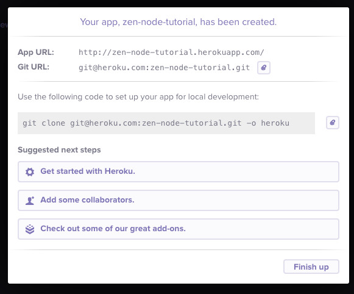

# A NodeJS 'Hello World' Tutorial using Heroku

This tutorial expects you to know nothing. The idea is to quickly create a simple web page that says 'Hello World' when you visit it using NodeJS. In the process, you will learn how to use git (for version control), and Heroku (a great way to fool around as a developer).

### Pre-requisites
If you know how to browse folders and files in the command line, you're good to go. This tutorial is aimed at Linux / Mac OS X.

Most of the stuff works in windows to, but you'll need to figure out how to install git, and change the direction of the slashes and stuff :p

### Heroku
Think of heroku as a super convenient way to deploy your developer doodles and see them online. So first of you need to create a heroku account [here](http://heroku.com). Once you're done signing up, you'll be taken to your dashboard page. On this dashboard page, click on 'create a new app'. Give your app a name and create it. Once you do, you'll have a pop up like this 
This is very useful, so leave this tab open, and go to your command line. It's time to use git.

### Git
Git is our version control system, and it plays well with Heroku. First off, check if git is already installed on your computer. Fire up terminal (or whatever shell you use) and run this.

    git --version

If git is installed, you'll get an output like this (the version number might be different, but you get the idea) - `git version 1.9.0`

If you don't have git, you can simply `sudo apt-get install git-core` on linux. On a mac, git comes installed by default, so the command above should work.

Now that git is installed, we need to create a folder for our new project. Give it a name of your choice and store it wherever you want to.

    cd /path/to/place/where/I/store/projects
    mkdir myNewProject

Now, we need to turn our project folder into a git repository

    cd myNewProject
    git init

You should get an output like this `Initialized empty Git repository in /path/to/project/projectName/.git/`

Now we have our repository ready. All we need to do now is write some code!

### Install Node
The best way to do this on a mac is to use [homebrew](http://brew.sh). So first install homebrew.

    ruby -e "$(curl -fsSL https://raw.github.com/Homebrew/homebrew/go/install)"

Then install Node

    brew install node

On ubuntu, you can just do this

    sudo apt-get install nodejs

Check if your install worked

    node --version

That should output something like `v0.10.25`. Please note you might have to use `nodejs --version` in some cases. Also run `npm --version`. This is node's own package manager, and is super useful.

### Your First Node server
Create a file in your repository and call it `web.js`
Now in this file, stick in this simple code.

    var http = require('http');

    var port = process.env.PORT || 5000;

    http.createServer(function (req, res) {
      res.writeHead(200, {'Content-Type': 'text/plain'});
      res.end('Hello World');
    }).listen(port);

    console.log('Server is running!');

Create another file in our repository and call it `Procfile`. Stick in this single line. This is basically an instruction to Heroku on how to run our node server.

    web: node web.js

Now we have a git repository containing some Node JS code and we're almost ready to deploy it on the web. But there's one last step. Go back to the command line and type this.

    npm init

Just keep hitting enter as it runs you through the options. This will create a `package.json` file for you that contains the name of your app, and will eventually content all your apps dependencies. At present, you have no dependencies, but heroku still needs this file to be present.

### Back to git
Now we go back to our shell and to our project folder. Type `git status`. You should see something like this (unless you're in the wrong folder!).

    On branch master
    Initial commit
    Untracked files:
      (use "git add <file>..." to include in what will be committed)
        Procfile
        web.js
        package.json
    nothing added to commit but untracked files present (use "git add" to track)

Now we need to commit our changes. Do the following -:

    git add .
    git commit -a -m "Initial Commit: Node hello world app"

Now we need to push our changes up to heroku! Go back to that open tab of yours and copy the git url. Use the command below, but make sure you replace my git url with yours -:

    git remote add heroku git@heroku.com:zen-node-tutorial.git

Now you've told git where to push the app. All that's left to do is to actually push it!

    git push heroku master

And you're done. Go to the project url  in my case, and you can see your hello world app in action!