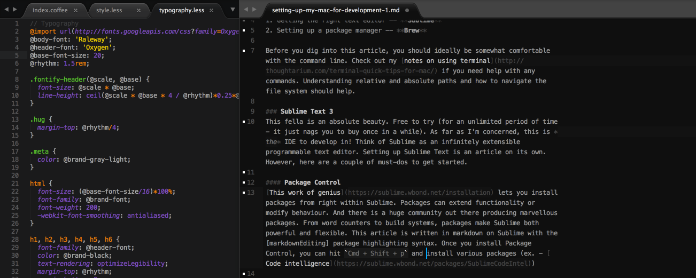

# Setting up my Mac for development - Part 1
After fooling around with my workflow for a while, I've found my mojo as far as my development environ goes. Here's what I've gleaned over time - I'll keep improving on this as and when I discover any new gems. This first post is going to look at -:

1. Getting the right text editor -- **Sublime**
2. Setting up a package manager -- **Brew**

Before you dig into this article, you should ideally be somewhat comfortable with the command line. Check out my [notes on using terminal](http://thoughtarium.com/terminal-quick-tips-for-mac/) if you need help with any commands. Understanding relative and absolute paths and how to navigate the file system should help.

### Sublime Text 3
This fella is an absolute beauty. Free to try (for an unlimited period of time - it just nags you to buy once in a while). As far as I'm concerned, this is *the* IDE to develop in! Think of Sublime as an infinitely extensible programmable text editor. Setting up Sublime Text is an article on its own. However, here are a couple of must-dos to get started.

#### Package Control
[This work of genius](https://sublime.wbond.net/installation) lets you install packages from right within Sublime. Packages can extend functionality or modify behaviour. And there is a huge community out there producing marvellous packages. From word counters to build systems, packages make Sublime both powerful and flexible. This article is written in markdown on Sublime with the [markdownEditing] package highlighting syntax. Here's a snapshot of what it looks like!

Once you install Package Control, you can hit `Cmd + Shift + p` and install various packages (ex. - [Code intelligence](https://sublime.wbond.net/packages/SublimeCodeIntel))

#### Subl from command line
If you want to open files from the command line in your favourite text editor, then open terminal and run this.

	ln -s "/Applications/Sublime Text.app/Contents/SharedSupport/bin/subl" ~/bin/subl

What you are doing here is creating a symlink or symbolic link. It's a useful concept to read about. Now you can just open a file or folder in sublime using -:

	#open folders
    subl path/to/folder/
    #open files
    subl path/to/file

#### Unofficial documentation
[This](http://docs.sublimetext.info/en/latest/index.html) is a peach of a link. Bookmark. Use.

### Brew
This is really *really* important. Get [homebrew](http://brew.sh). It is *the* package manager. It makes managing, upgrading and removing packages (i.e. software) a breeze. Trust me, it can be a real pain in the behind without brew. Once you install brew, remember to tweak your path file. This is really important.

#### Installation
It's just one command.

	$ ruby -e "$(curl -fsSL https://raw.github.com/Homebrew/homebrew/go/install)"

#### Post installation
Run `brew doctor`. In all likelihood it will throw you a warning.

	Warning: /usr/bin occurs before /usr/local/bin
    This means that system-provided programs will be used
    instead of those provided by Homebrew.

Check your PATH variable using `echo $PATH`. The PATH variable, in essence, stores a list of places that terminal will look in, when attempting to make sense of any shell command.

You need to make sure that it looks in your brew folder first, before looking in other folders. This will ensure that as long as you installed something in brew, your computer will always run the brew version of it, rather than running some other version that has already been installed in your system. Do that by doing the following. Open the /etc/paths file in a text editor (make sure that you did the steps above to ensure the `subl` command works!) and then move usr/local/bin all the way to the top -:

	sudo subl /etc/paths

- `/usr/local/bin`
- `/usr/local/sbin`
- `/usr/bin`
- `/bin`
- `/usr/sbin`
- `/sbin`

Save the file and close. Restart terminal. Check using the command `echo $PATH`. It should be in the right order now. Run `brew doctor` again. You should be good to start brewing stuff!