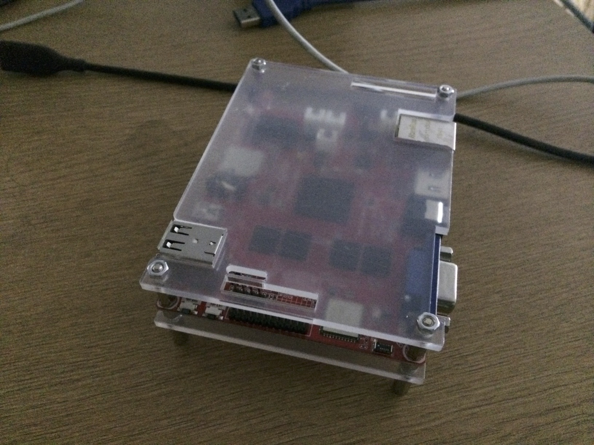

# Setting up my web server on a CubieTruck
So, I was all curious about these single board computers and thought I'd get my hands on one. The original aim was to set up a raspberry pi as a media server. When we went to the [raspberry pi distributor](www.crazypi.com) (nice chap, sells the pi and accessories in Bangalore), we found a more powerful alternative - the CubieTruck. 2GHz arm allwinner processor, 8 gig onboard flash storage, 2 gigs of RAM. We figured might as well buy it.

We decided to use this fellow as a webserver for one of our new projects. So here's what we did -:

## The Steps
1. Flashed the cubietruck NAND storage with Arch Linux ([you can get that here](http://dl.cubieboard.org/software/a20-cubietruck/archlinux/ct-arch-v2/))
2. Created a new admin user with sudo permissions.
3. Installed nodejs using pacman
4. Installed postgresql using pacman (arch's package manager)
5. Configured postgres
	- Initialized the postgres database
	- Set a password for the *postgres* user
    - Configured remote access